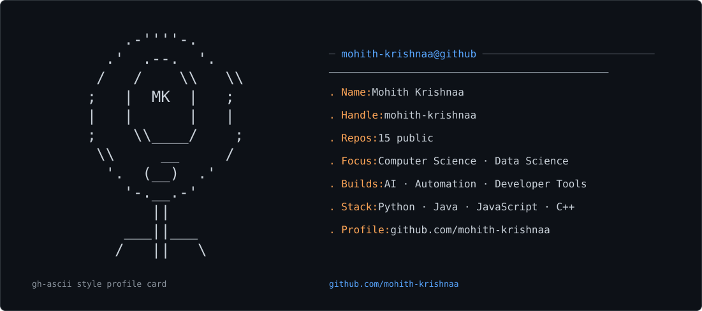

<picture>
  <source media="(prefers-color-scheme: dark)" srcset="dark_mode.svg" />
  <source media="(prefers-color-scheme: light)" srcset="light_mode.svg" />
  
</picture>

<div align="center">


# MOHITH KRISHNAA

### Computer Science · Data Science · Builder

`build → break → understand → rebuild`

I build **software, automation, AI applications and developer tools** that solve practical problems.

[Portfolio](https://github.com/mohith-krishnaa/mohithkrishnaa-portfolio) · [GitHub](https://github.com/mohith-krishnaa) · [LinkedIn](https://www.linkedin.com/in/mohithkrishnaa)

</div>

---

## `01 / flagship`

### 🌾 CropMarket

**My strongest product-focused project.**

A farming decision-support application built around crop prices, market comparison, trends, profitability calculations, weather context, crop tools, multilingual interaction and voice-friendly workflows.

**React · JavaScript · Recharts · Product UI**

**[Live Demo](https://cropmarketapp.netlify.app/) · [Source](https://github.com/mohith-krishnaa/CropMarket)**

---

## `02 / selected work`

| Project | What it does | Stack |
|---|---|---|
| **[Protobuf Hex Inspector](https://github.com/mohith-krishnaa/protobuf-hex-inspector)** | Schema-less Protobuf HEX inspection and wire-type decoding | JavaScript |
| **[HealthAI Pro+](https://github.com/mohith-krishnaa/healthai-java-chatbot)** | Educational AI assistant with Java backend and local fallback | Java · AI |
| **[FF Icon Extractor](https://github.com/mohith-krishnaa/Iconsextractor)** | Asset-ID scanning and icon preview utility | JavaScript |
| **[EduAI Platform](https://github.com/mohith-krishnaa/EduAI-Platform)** | AI-assisted information retrieval and summarization interface | Web · AI |
| **[Bpasset](https://github.com/mohith-krishnaa/Bpasset)** | Booyah Pass asset exploration and preview tool | JavaScript |
| **[stegano.io](https://github.com/mohith-krishnaa/stegano.io)** | Browser-based image steganography utility | JavaScript |

### Live demos

**[Protobuf Inspector](https://mohith-krishnaa.github.io/protobuf-hex-inspector/)** · **[HealthAI](https://mohith-krishnaa.github.io/healthai-java-chatbot/)** · **[FF Icon Extractor](https://mohith-krishnaa.github.io/Iconsextractor/)** · **[EduAI](https://mohith-krishnaa.github.io/EduAI-Platform/)** · **[Bpasset](https://mohith-krishnaa.github.io/Bpasset/)**

---

## `03 / automation`

### Telegram pipelines

**[Anime News Bot](https://github.com/mohith-krishnaa/animenewsbotbymk)**

Scraping → parsing → formatting → image publishing → duplicate protection → scheduled Telegram delivery.

[Live channel](https://t.me/AniTimesIsland_acn)

**[Gaming News Bot](https://github.com/mohith-krishnaa/gamedianewsbot)**

Automated gaming-news ingestion, processing and scheduled Telegram publishing.

[Live channel](https://t.me/GamediaNews_acn)

### Self-hosted

**[Social Media Downloader](https://github.com/mohith-krishnaa/socialmediadownloader)** — Flask + `yt-dlp`, with resource limits, concurrency controls, file-size checks and temporary-file cleanup.

It is intentionally **not publicly deployed** to avoid unnecessary hosting costs and uncontrolled usage.

---

## `04 / stack`

```text
LANGUAGES      Python · Java · C++ · JavaScript

WEB            HTML · CSS · React · Browser APIs

BACKEND        Flask · FastAPI · REST · HTTP · JSON

DATA           NumPy · Pandas · MongoDB

AUTOMATION     BeautifulSoup · Requests · yt-dlp
               Telegram Bot API · GitHub Actions

TOOLS          Git · GitHub · Linux · Docker

AI             Gemini API · AI applications
```

---

## `05 / how I build`

```text
IDEA
 ↓
BUILD
 ↓
TEST REAL BEHAVIOR
 ↓
FIND WHAT BREAKS
 ↓
UNDERSTAND WHY
 ↓
REBUILD BETTER
```

I care more about **working software and honest limitations** than inflated project descriptions.

---

## `06 / currently`

- Building and improving practical software projects
- Strengthening Java, Python, backend and system fundamentals
- Exploring AI-assisted applications and automation
- Turning older projects into cleaner, more maintainable work
- Keeping this portfolio current as projects evolve

---

## `07 / portfolio`

For the visual version of the portfolio:

**[→ Open Portfolio](https://mohith-krishnaa.github.io/mohithkrishnaa-portfolio/)**

---

<div align="center">

`Still learning. Still building. Still breaking things.`

**[@mohith-krishnaa](https://github.com/mohith-krishnaa)**

</div>
